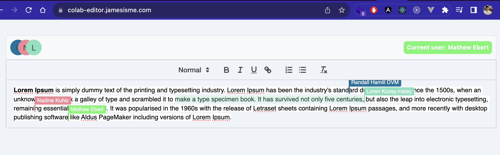

# Colab Editor
<div align="center">
  
</div>
This is demo for colaborative editor using Quill Editor and React

Demo: https://colab-editor.jamesisme.com

# Setup
Install dependencies:
```
yarn install
```

Then start project
```
yarn dev
```
# Build
## Native build
To build the project, run:
```
yarn build
```
Then start project with:
```
yarn start
```
## Docker build

The project can also be built with Docker
```
docker build -t colab-editor .
```
Then start with Docker compose
```
docker compose up -d
```
Then you should be able to access the app at `http://localhost:3030`